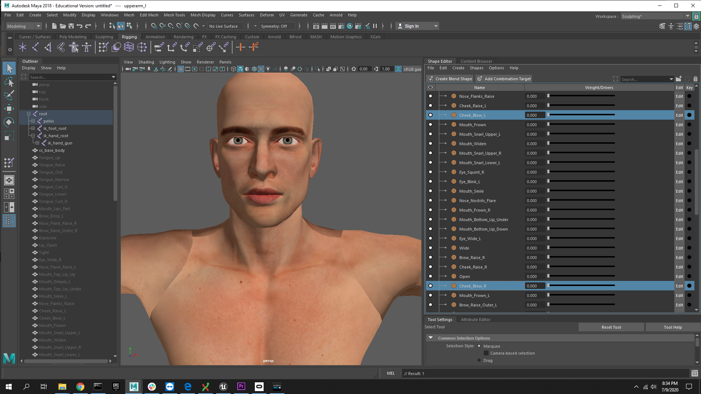
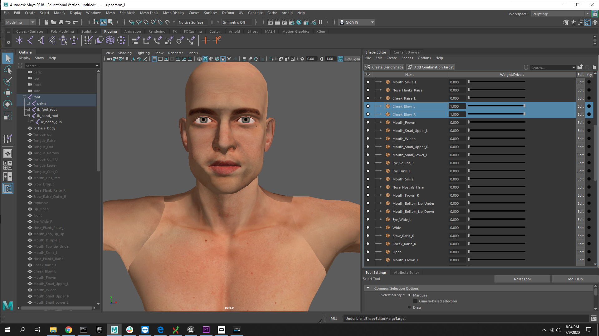
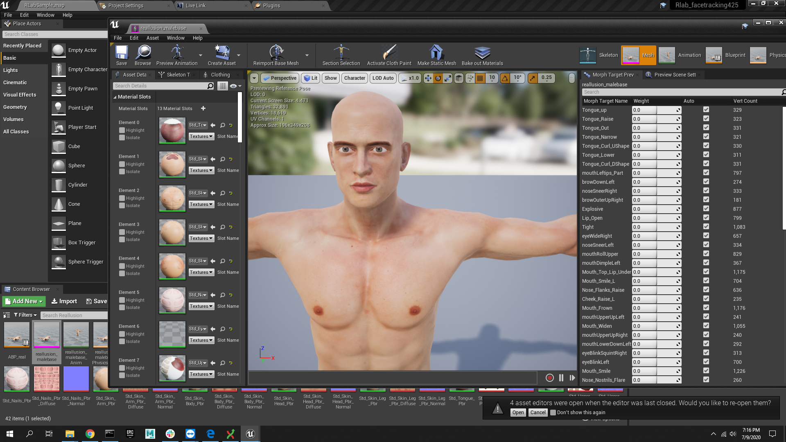
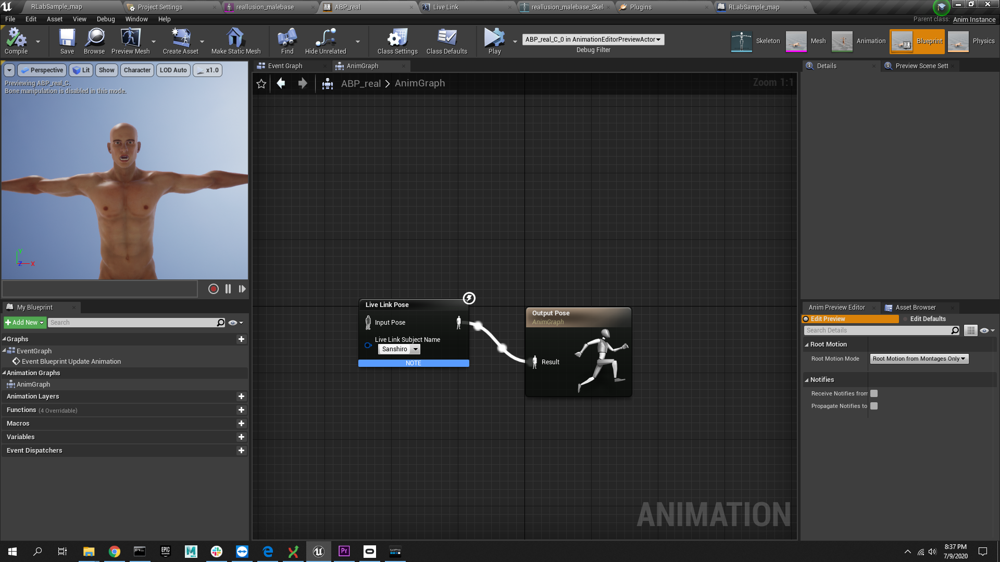
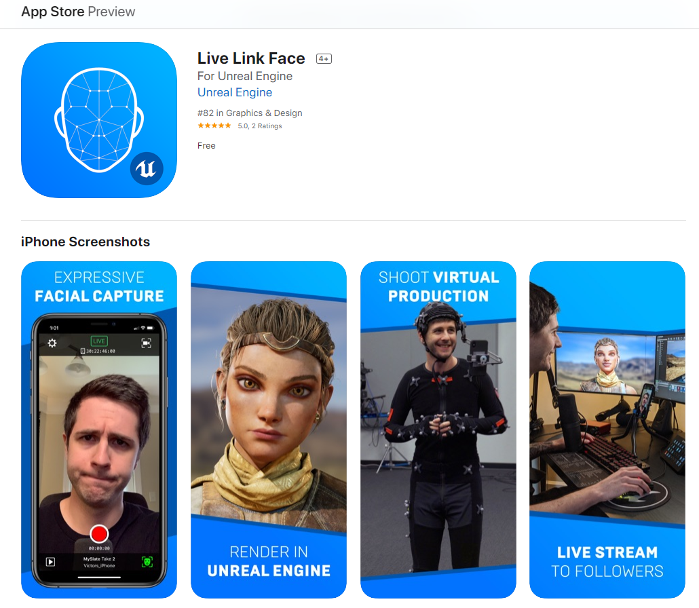

# Authors

Todd Bryant, Kat Sullivan, Grant Ng and Jiuxin Zhu

# From the RLab!

To learn more about us visit our website [here](https://www.rlab.nyc/)

## Description
Now with ARKit and an iPhone with a front-facing True Depth camera you can track your facial features allowing you animate digital avatars. The avatars first have to be prepared with point-level animation called blendshapes.  ARKit uses 52 of these to animate the avatar faces.  3D modelling is a craft that takes a long time to master and setting up all of these blendshapes can be daunting, so we’ve developed a workflow to ease the barrier to get your character up and running in a matter of minutes by leveraging two free avatar creation tools: Reallusion, Adobe Fuse, and MakeHuman. All three programs have more than enough blendshapes to animate a face, they just need to be renamed to the ARKit conventions. We’ve developed a simple script to automate of lot of this process. We set up a simple project for you get started so please feel free to adapt or add more blendshapes if necessary. 

### Fuse example (added eye movements)


### MakeHuman example


### Reallusion example


### Required Software To Be Installed: 
* Reallusion Character Creation 3: https://www.reallusion.com/character-creator/ (Free trial version is available with limited exports!)
* Fuse downloaded from here: https://www.adobe.com/products/fuse.html
* Need to create a mixamo account (Its free!): https://www.mixamo.com/#/
* MakeHuman downloaded here: http://www.makehumancommunity.org/
* Maya student version download here: https://www.autodesk.com/education/free-software/maya
* Unreal downloaded here: https://www.unrealengine.com/en-US/get-now/agnostic
* Python download here: https://www.python.org/downloads/ **scroll all the way to see how to download properly!**
### Software versions:
* Unreal version 4.25 
* Live Link Face app for iOS (Requires iOS 13.0 or later). Compatable with iPhone, iPad, and iPod touch. 
* Maya 2018 or 2019
* Blender 2.83
* Python 3.8  
This tutorial requires some knowledge of using 3D software and game engine mechanics. We will provide more links for beginners that walk you through a more in depth overview. 

### This document will be divided up into sections and address the workflow for converting characters for Face Tracking in Character Creator 3.
1. Exporting Blendshapes from character creator software and importing into Maya
   - Opening up Character Creator 3 (CC3)
   - Starting with a base model
   - Export as a fbx
   - Import into Maya
   - Fixing blendshapes
2. Python Scripting
   - Knowledge and Filestructuring
   - Renaming the blendshapes
3. Importing in Unreal
   - Importing the FBX
   - Setting up blueprints in Unreal

# Importing and Exporting free 3D characters blendshapes with Maya

First steps you need to have the LiveLink app downloaded onto your iPhone before you start this tutorial. Then download or clone this repository somewhere on your computer. 
There are multiple ways to have a fully rigged character and have a facial rig set up in minutes. 

**1. Exporting blendshapes from CC3 and importing into Maya**
   - **After Opening CC3:**
   - Once you have downloaded Character Creator 3, open the program and in the content window, select base icon (It has two people), there will be several drop downs, select "Full body" and choose a CC3 female or male base. 


   - After you select the base model, you are ready to export as a fbx file


   - **Export settings**
     - Make sure you select Unreal.
     - FBX Options are Mesh and Motion. 
     - Under include motion select "Current Pose"
	 - Make sure "Delete hidden faces" IS NOT CHECKED (this is for blendshapes). 


Download your character as FBX. It should already be rigged and in a T-Pose. (Your character should start out as a t-pose by deafault). 
   - **Reallusion to Maya**
	  -  Import the FBX into Maya. Choose the "Sculpting" layout from the top right "Workspaces" dropdown menu. It will change the layout of Maya to bring up the Blendshapes. This is a screenshot of what the blendshapes will come out as when you open the Reallusion FBX file in Maya. You can drag the sliders for each shape and see how it affects the face mesh.
	


   - After the import is done, you see all the blendshape names and will have key frames selected on some of them.
	  - In Maya, make sure the workspace name should open as "sculpting""
	  - If you want to turn of the red dots, you can select all the blendshapes and right click on the red button and select "remove key frame" 
	 
	 


  
When you select the blendshape targets you can move the sliders back and forth and you will be able to see eye’s blinking and the mouth opening and closing. Once you have your character all set up in Maya, you can save this file as a Maya Ascii file. Make sure the file is saved with a .ma extension. Make a folder for this project and place this file in it.  For simplicity’s sake use a root directory (D:\BlendshapesFaceTracking) this is  important for the next steps that involve running a python script. 

On the right, you will need to rename the blendshape group of “CC3_Base_Body_ncl1_1” to Blendshape_[ name of mesh]. 


   - **Merging Blendshapes in Maya:**
	  - There are two blendshapes that need to be merged and one renamed  in maya, first, you need to identify.
	  - Brow_Raise_Inner_L and Brow_Raise_Inner_R.
	  - Cheek_Blow_L and Cheek_Blow_R.
	  - Mouth_Blow

Once you can see all the blendshapes, shown in the previous picture, scroll all the way down look for three types.


In this example picture you want to select both the Left and Right blendshapes. Be sure to drag the toggles all the way to the right and select both Left and Right blendshapes and right click into one of them and select merge targets. Once it is merged you need to find the name again, and rename it to **browInnerUp**, the name has to be exact!

   - **Repeat the process for all three, then rename the merged blendshape to the names in bold:**
	 - Brow_Raise_Inner_L and Brow_Raise_Inner_R = **browInnerUp**
	 - Mouth_Blow = **mouthPucker**
	 - Cheek_Blow_L and Cheek_Blow_R = **cheekPuff**

   - Here are some screenshots for reference





**Be sure to save this file as a “.ma” (maya ASCII) file for running python script later on!**

# Setting Up Our Python Script

## Be sure to read our setup [here](https://github.com/RLabNYC/RLab_FaceTracking_RenameScripts)


If you don't have Python 3, download Python [here](https://www.python.org/downloads/). **Make sure you check off "Python version number to PATH"!** Also be sure to include pip in the installation. (If you don't, details on how to do that are below). 


# Installing pip

If you already have pip installed, please skip this section.

In terminal, cd to where you installed the renaming repository, then cd to the PythonScripts folder.
To install pip, simply run:

```
python get-pip.py
```

# How To Run Our Script

Here is the link to the files for the [python scripts](https://github.com/RLabNYC/RLab_FaceTracking_RenameScripts/tree/master/PythonSripts).

The script will take care of any additional python libraries and run the Python renaming script. It will search for a csv file in the PythonScript folder so **be sure you choose either the Fuse.csv or Makehuman.csv file (found in the csv_files folder) and move it inside the PythonScripts folder**. You will also place your Maya file (.ma) into the PythonScripts folder. The script will rewrite the .ma file with the correct naming syntax in order to have the blendshapes register in Unreal. The blendshapes needs to be named in a specific way for Apple’s ARKit to work on the new model.  


  - The file structure should look this. 

  - You want make sure you match the **fuse.csv** with the **fuse model** from maya and the **makehuman.csv** with the **makehuman model**. 


##### For Windows Users:

Once that is done, be sure to be running command prompt as admin and from the PythonScripts folder run:

```
runme.bat
```

If you have any pip-related issues try upgrading pip by:

```
py -m pip install --upgrade pip
```

**For MAC Users:** 

- open terminal, search for” terminal” in the finder. 
- Navigate to the folder where the python scripts live (cd into the folder). 
Open the terminal and type in: 

```
	source runme.sh
```
Once the program runs make sure to type in: 
```
deactivate
```


# Download Our Repo

**3. Importing into Unreal**
   - You should have our project downloaded or cloned on your computer by this point.
   - Once the project is downloaded make sure you save it a place where you can find it easily. Please refer to Unreal’s documentation on setting up the Unreal environment and selecting the map for prototyping. Here is the link again https://docs.unrealengine.com/en-US/Platforms/AR/HandheldAR/FaceARSample/index.html. 

      - When you open the faceAR project in Unreal again, import the FBX into Unreal with these settings:


  - Need to make sure that “Import Morph Targets”  is checked off. Once it is imported as a mesh and as skeletal, the import default settings should take care of itself. 

If you need further assistance, refer to this documentation from Unreal: https://docs.unrealengine.com/en-US/Engine/Content/FBX/MorphTargets/index.html

Once it is imported into Unreal. You should be able to open up the skeletal mesh asset and see the renamed blendshapes. Test the sliders to see if they work on the model. 

### Reallusion example




If you see an error or the blendshapes are named differently, make sure to double check the grouping name of the blendshapes, this is the group that should be named “Blendshape_mesh”. 


In this example, the “Body_ncl1_4” needs to be renamed to Blendshape_mesh. 

Our repo will have everything set up for you to test the Livelink app on yor phone with our Unreal sample project.

## Adding eye movements

  **How to make eyes move** (try this out on our sample reallusion model). 
  1. Create a new PoseAsset (Create Asset - Create PoseAsset - Current Pose)
        - 
  2.  In the PoseAsset, add eye movements. 
        - a. **To do this:**
           - **Rotate the eyeball to the position you want the pose to be.**
	       - 
	    - b. **Insert Pose to the PoseAsset (Create Asset - Create PoseAsset - Insert Pose - [Choose Your PoseAsset]).**
	       - 
	    - c. **Slide the slidebar of the new pose to 1. The eyeball will now be in an unwanted position, but it’s okay.**
	       - 
	    - d. **Rotate the eyeball back to where you want it to be.**
	       - 
	    - e. **Slide the slidebar of the new pose back to 0.**
	       -   
	    - f. **Rename the new pose according to the naming conventions for Apple blendshapes (https://developer.apple.com/documentation/arkit/arfaceanchor/blendshapelocation)**
	       - 
	    - g. **Do the above for all other poses, the result should look like this:**
	       -  
		   - Note: You should rotate the eyeball to the position you want first, and then insert a new pose. You can delete Pose_0 in the screenshot above.
	    - h. **Connect the PoseAsset in Animation Blueprint. It should work now.**
		   - 

		
## Enabled plugins in Unreal 

   - Make sure these plugins are enabled in Unreal. 
     - **Livelink** 
     - 
   - **Apple ARkit**
     - 

   - **LiveLink**
     - Make sure you are able to see your phone
     - 


## Blueprints in Unreal

- Check out our blueprints that should be set up for you already. Make sure our level blue print has a *Start-AR-Session* node connected to *Event Begin Play* 
- You should see two sample characters in the project. Go into their animation blueprints and see how they are set up. 

- We have already prepared the sample blueprints for you in this project.

**Use the Unreal documentation for a more detailed set up.**

Steps for getting the iPhone to control facial movements in Unreal. 
Please refer to the documentation from Unreal to setup the face tracking from scratch here:
https://docs.unrealengine.com/en-US/Platforms/AR/HandheldAR/FaceARSample/index.html

Here is a link to Apple’s blendshape guidelines: https://developer.apple.com/documentation/arkit/arfaceanchor/blendshapelocation

   - **Here is a simplified list of the setup:**
     - Make sure the blendshapes are named correctly. 
     - Enable face tracking in the Defaultengine.ini file. 
     - Create and apply the data asset.
     - Create a sessionAR function in the level blueprint. 

     - Create an animation blueprint that connects livelink node and set the name to “iPhoneXFaceAR” exactly. 
       - Right click in the content browser in an empty space > go to “Animation” > select “Animation blueprint” > Under parent class Select “anim instance” > Under target skeleton select the name of your imported fbx file > click “ok” and rename it and make sure you know where it is. 

   - **Level Blueprint**
     - 
   - **Animation Blueprint**
   - **Example animation blueprint**
      - 


# Download The App

Look on the app store on your iPhone and download the *Live Link Face* app. To Learn more about how to set the connection on your phone go to Unreal's [documentation](https://docs.unrealengine.com/en-US/Engine/Animation/FacialRecordingiPhone/index.html) for further instructions. 



  - Type in your ip adress
  - To find out what your IPv4 adress is:
On PC: Open the command line and type in
```
ipconfig
```
On Mac type in 
```
ifconfig
```
Or go into your "system preferences" click on "Network" and then you will see the ip address on the right. 


## Almost Done! 

  - Make sure your phone and computer are connected on the same network!
  - On the app click connect and then press play in Unreal, while it's running, you might need to click again on the phone app and you will start to see the faces move!

  **Congratualtions!** You just completed facial tracking in Unreal for free!

## Editing the blendshapes more in maya
If you feel that the facial expressions can be exaggerated more you can look into more maya techniques in manipulating the mesh [here](https://youtu.be/iTPxiQVMlbE?t=737).
You can refer to this tutorial on editing blendshaps with the verticies [here](https://www.youtube.com/watch?v=C29DJYBLh_M&t=155s). 
### Example of editing the mesh


# Conclusion

Please feel free to add content by pullrequests, we are three to four people managing this repo, so our review process will be relatively fast. 

  - **Make A Branch**
    - Please create a separate branch for each issue that you're working on. Do not make changes to the default branch (e.g. master, develop) of your fork.
  - **Push Your Code ASAP**
    - Push your code as soon as you can. Follow the ["early and often"](https://www.worklytics.co/blog/commit-early-push-often/) rule.
    - Make a pull request as soon as you can and **mark the title with a "[WIP]"**. You can create a [draft pull request](https://help.github.com/en/articles/about-pull-requests#draft-pull-requests).[Screenshot: How to create draft PR?](https://opensource.creativecommons.org/contributing-code/pr-guidelines/draft_pr.gif). 
  - **Describe Your Pull Request**
    - Use the format specified in pull request template for the repository. Populate the stencil completely for maximum verbosity.
      - Tag the actual issue number by replacing #[issue_number] e.g. #42. This closes the issue when your PR is merged.
      - Tag the actual issue author by replacing @[author] e.g. @issue_author. This brings the reporter of the issue into the conversation.
      - Mark the tasks off your checklist by adding an x in the [ ] e.g. [x]. This checks off the boxes in your to-do list. The more boxes you check, the better.
    - Describe your change in detail. Too much detail is better than too little.
    - Describe how you tested your change.
    - Check the Preview tab to make sure the Markdown is correctly rendered and that all tags and references are linked. If not, go back and edit the Markdown.
    - [Screenshot: Populated pull request](https://opensource.creativecommons.org/contributing-code/pr-guidelines/populated_pr.png).
  - **Request Review**
    - Once your PR is ready, remove the "[WIP]" from the title and/or change it from a draft PR to a regular PR.
    - If a specific reviewer is not assigned automatically, please [request a review](https://help.github.com/en/articles/requesting-a-pull-request-review) from the project maintainer and any other interested parties manually.
  - **Incorporating feedback**
    - If your PR gets a 'Changes requested' review, you will need to address the feedback and update your PR by pushing to the same branch. You don't need to close the PR and open a new one.
    - Be sure to re-request review once you have made changes after a code review.
    - [Screenshot: How to request re-review?](https://opensource.creativecommons.org/contributing-code/pr-guidelines/rereview.png)
    - Asking for a re-review makes it clear that you addressed the changes that were requested and that it's waiting on the maintainers instead of the other way round.
    - [Screenshot: Difference between 'Changes requested' and 'Review required'](https://opensource.creativecommons.org/contributing-code/pr-guidelines/difference.png).


