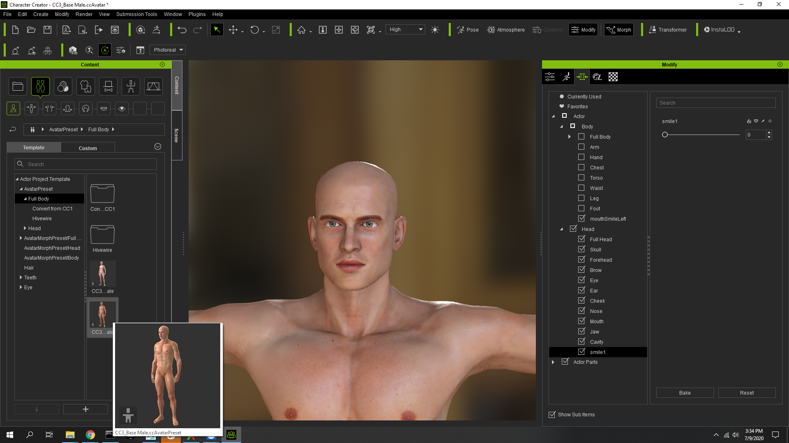
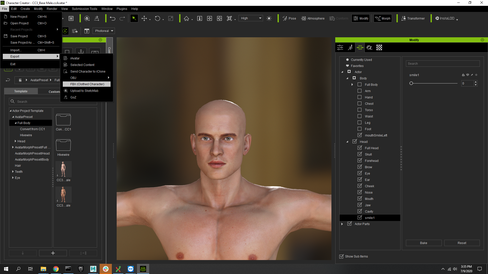
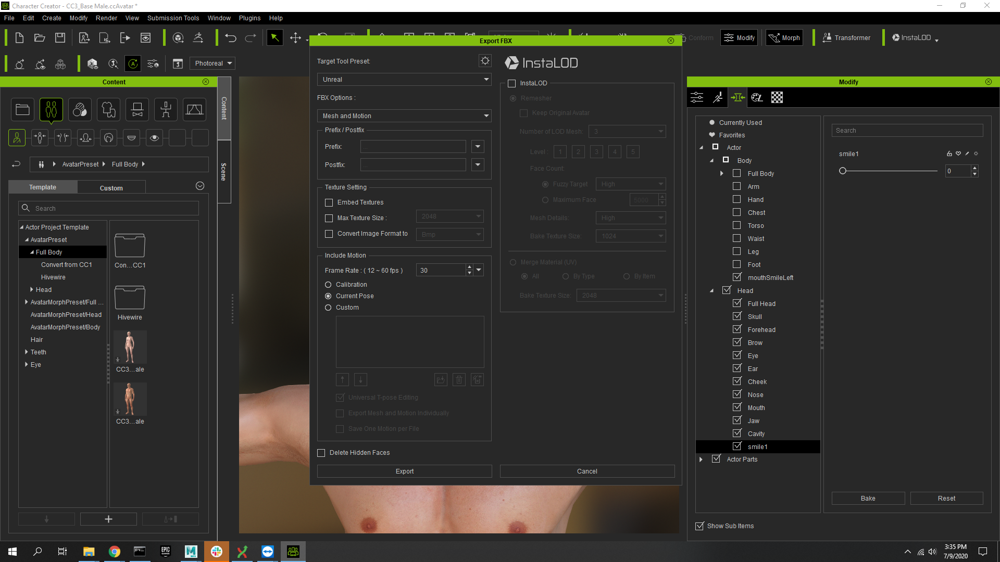

# Authors

Todd Bryant, Kat Sullivan, Grant Ng and Jiuxin Zhu

# From the RLab!

To learn more about us visit our website [here](https://www.rlab.nyc/)

## Reallusion example

Welcome! This is the **Reallusion** workflow for facial tracking! This is an example of what a reallusion character will look like with facetracking. 

We made other repos that incorporate other free 3D modeling softwares, please check them out! 

### Required Software To Be Installed: 
* Reallusion Character Creation 3: https://www.reallusion.com/character-creator/ (Free trial version is available with limited exports!)
* Maya student version download here: https://www.autodesk.com/education/free-software/maya
* Unreal downloaded here: https://www.unrealengine.com/en-US/get-now/agnostic
### Software versions:
* Unreal version 4.25 
* Live Link Face app for iOS (Requires iOS 13.0 or later). Compatable with iPhone, iPad, and iPod touch. 
* Maya 2018 or 2019

This tutorial requires some knowledge of using 3D software and game engine mechanics. We will provide more links for beginners that walk you through a more in depth overview. 

# Importing and Exporting free 3D characters blendshapes with Maya

### For experienced individuals only!
 - If you are an already experienced in facial tracking, you can download this repo and it will be ready to work with the livelink app already!

## For Beginners
 - This repo is mainly for beginners who want to get into facetracking for personal projects, virtual production or just for fun. Please keep in mind that this repo is for the Unreal engine.

**1. Exporting blendshapes from CC3 and importing into Maya**
   - **After Opening CC3:**
   - Once you have downloaded Character Creator 3 software, open the program and in the content window, select base icon (It has two people), there will be several drop downs, select "Full body" and choose a CC3 female or male base. 

   - After you select the base model, you are ready to export as a fbx file

   - **Export settings**
     - Make sure you select Unreal.
     - FBX Options are Mesh and Motion. 
     - Under include motion select "Current Pose"
	 - Make sure "Delete hidden faces" IS NOT CHECKED (this is for blendshapes). 

Download your character as FBX. It should already be rigged and in a T-Pose. (Your character should start out as a t-pose by deafault). 
 

# The next steps are [here](https://github.com/RLabNYC/Rlab_FaceTracking_reallusion/blob/master/RUNSCRIPT.md)

## If you need to go back to the table of [contents](https://github.com/RLabNYC/RLab_Facetracking). 

