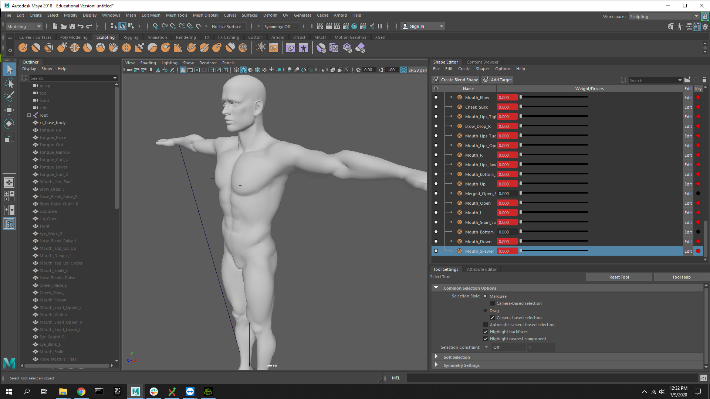
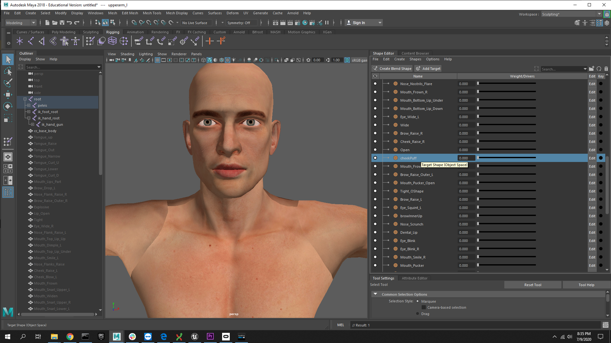

# Software that should be downloaded already before these steps
 * Maya student version download here: https://www.autodesk.com/education/free-software/maya
 * Unreal downloaded here: https://www.unrealengine.com/en-US/get-now/agnostic
 
 
 **Reallusion to Maya**
	  -  Import the FBX into Maya. Choose the "Sculpting" layout from the top right "Workspaces" dropdown menu. It will change the layout of Maya to bring up the Blendshapes. This is a screenshot of what the blendshapes will come out as when you open the Reallusion FBX file in Maya. You can drag the sliders for each shape and see how it affects the face mesh.
	

   - After the import is done, you see all the blendshape names and will have key frames selected on some of them.
	  - In Maya, make sure the workspace name should open as "sculpting""
	  - If you want to turn of the red dots, you can select all the blendshapes and right click on the red button and select "remove key frame" 
	 
	 

  
When you select the blendshape targets you can move the sliders back and forth and you will be able to see eye’s blinking and the mouth opening and closing. On the right, you will need to rename the blendshape group of “CC3_Base_Body_ncl1_1” to Blendshape_[ name of mesh]. 

   - **Merging Blendshapes in Maya:**
	  - There are two blendshapes that need to be merged and one renamed  in maya, first, you need to identify.
	  - Brow_Raise_Inner_L and Brow_Raise_Inner_R.
	  - Cheek_Blow_L and Cheek_Blow_R.
	  - Mouth_Blow

Once you can see all the blendshapes, shown in the previous picture, scroll all the way down look for three types.

In this example picture you want to select both the Left and Right blendshapes. Be sure to drag the toggles all the way to the right and select both Left and Right blendshapes and right click into one of them and select merge targets. Once it is merged you need to find the name again, and rename it to **browInnerUp**, the name has to be exact!

   - **Repeat the process for all three, then rename the merged blendshape to the names in bold:**
	 - Brow_Raise_Inner_L and Brow_Raise_Inner_R = **browInnerUp**
	 - Mouth_Blow = **mouthPucker**
	 - Cheek_Blow_L and Cheek_Blow_R = **cheekPuff**

   - Here are some screenshots for reference

# The next steps are [here](https://github.com/RLabNYC/Rlab_FaceTracking_reallusion/blob/master/IMPORTING.md)

## If you need to go back to the table of [contents](https://github.com/RLabNYC/RLab_Facetracking). For the reallusion modeling steps go [here](https://github.com/RLabNYC/Rlab_FaceTracking_reallusion/blob/master/README.md)
